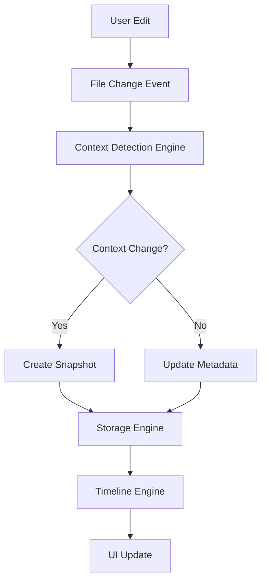

# Arquitectura del Sistema - Timeline Writer

## Resumen Arquitectónico

Timeline Writer implementa una arquitectura de microservicios internos con separación clara de responsabilidades, optimizada para performance y escalabilidad.

## Componentes Principales

### [Modelos de Datos](./data-models.md)
Interfaces TypeScript y estructuras de datos que definen todo el sistema
- TimelineNode: Nodos de timeline ramificado
- VersionSnapshot: Snapshots de contenido con compresión
- ContextDefinition: Definiciones de contextos narrativos
- Análisis y detección: Señales y resultados de análisis

### [Storage Engine](./storage-engine.md)
Sistema híbrido de persistencia optimizado para archivos de texto
- SQLite embebido para metadatos e índices
- Sistema de compresión para diffs y snapshots
- Migraciones automáticas de schema
- Backup y recovery robusto

### [Context Detection Engine](./context-detection.md)
Motor de inteligencia artificial para detección automática de contextos
- Análisis semántico con TF-IDF
- Detección multi-señal (keywords, temporal, comportamental)
- Fusión ponderada de señales
- Sistema de aprendizaje adaptativo

### [Timeline Engine](./timeline-engine.md)
Gestor de navegación temporal y ramificación
- Timeline ramificado con nodos padre/hijo
- Navegación bidireccional
- Merge de ramas con detección de conflictos
- Pathfinding entre versiones

## Arquitectura de Capas

```
┌─────────────────────────────────────────────┐
│                UI Layer                     │
│  React Components + Obsidian Integration   │
├─────────────────────────────────────────────┤
│              Service Layer                  │
│    Context Detection + Version Manager     │
├─────────────────────────────────────────────┤
│               Core Layer                    │
│  Timeline Engine + Storage Engine + Utils  │
├─────────────────────────────────────────────┤
│               Data Layer                    │
│     SQLite + File System + Compression     │
└─────────────────────────────────────────────┘
```

### UI Layer
- **Componentes React**: Timeline view, comparison, settings
- **Obsidian Integration**: Sidebar, commands, ribbon buttons
- **Responsive Design**: Adaptable a diferentes tamaños de pantalla

### Service Layer
- **Context Detection Service**: Coordinación de análisis multi-señal
- **Version Management Service**: Orchestración de snapshots y checkpoints
- **Integration Service**: Manejo de eventos de Obsidian

### Core Layer
- **Timeline Engine**: Lógica de navegación temporal
- **Storage Engine**: Persistencia y recuperación de datos
- **Compression Engine**: Optimización de storage
- **Analysis Engines**: Semántico, temporal, comportamental

### Data Layer
- **SQLite Database**: Metadatos estructurados
- **File System**: Archivos markdown y assets
- **Compressed Storage**: Diffs y snapshots optimizados

## Patrones Arquitectónicos

### Repository Pattern
Abstracción de acceso a datos con interfaces consistentes

### Observer Pattern
Sistema de eventos para coordinar cambios entre componentes

### Strategy Pattern
Múltiples algoritmos de detección y fusión intercambiables

### Command Pattern
Operaciones de versionado como comandos ejecutables y reversibles

### Factory Pattern
Creación configurable de engines y analyzers

## Flujo de Datos Principal



## Integración con Obsidian

### Event Handling
- `vault.on('modify')`: Detección de cambios en archivos
- `vault.on('create')`: Nuevos archivos en timeline
- `vault.on('delete')`: Cleanup de versiones

### API Integration
- **Vault API**: Lectura/escritura de archivos
- **Workspace API**: UI integration
- **Settings API**: Configuración persistente

### Plugin Lifecycle
```typescript
export default class TimelineWriterPlugin extends Plugin {
  async onload() {
    // 1. Initialize storage engine
    // 2. Setup context detection
    // 3. Register event handlers
    // 4. Create UI components
  }
  
  async onunload() {
    // 1. Cleanup resources
    // 2. Save pending data
    // 3. Unregister handlers
  }
}
```

## Performance Considerations

### Lazy Loading
- UI components cargados bajo demanda
- Análisis semántico diferido para archivos grandes
- Timeline data paginado

### Caching Strategy
- LRU cache para análisis de contenido
- Context vectors cacheados
- Timeline nodes en memoria

### Background Processing
- Análisis semántico en web workers
- Compresión de diffs asíncrona
- Cleanup de storage programado

## Escalabilidad

### Memory Management
- Streaming para archivos >10MB
- Garbage collection de objetos temporales
- Memory pools para objetos frecuentes

### Storage Optimization
- Compresión adaptativa según tamaño
- Índices optimizados para queries frecuentes
- Archivado automático de versiones antiguas

### Concurrent Operations
- Locking para operaciones críticas
- Queue de operaciones de escritura
- Transacciones ACID para consistencia

## Security Considerations

### Data Protection
- Encriptación opcional de contenido sensible
- Validación de integridad con checksums
- Backup automático antes de operaciones riesgosas

### Input Validation
- Sanitización de entrada de usuario
- Validación de schemas de datos
- Rate limiting para operaciones costosas

## Monitoring y Debugging

### Logging Strategy
```typescript
export enum LogLevel {
  DEBUG = 0,
  INFO = 1,
  WARN = 2,
  ERROR = 3,
  CRITICAL = 4
}

export class Logger {
  log(level: LogLevel, message: string, context?: any) {
    // Structured logging with context
  }
}
```

### Performance Metrics
- Latencia de operaciones críticas
- Memory usage por componente
- Success rate de detecciones
- Error rates y recovery

### Error Handling
- Try-catch en todas las operaciones async
- Graceful degradation en fallos
- Error reporting para debugging
- Auto-recovery cuando sea posible

Esta arquitectura proporciona una base sólida para implementar todas las funcionalidades del plugin manteniendo performance, escalabilidad y mantenibilidad.