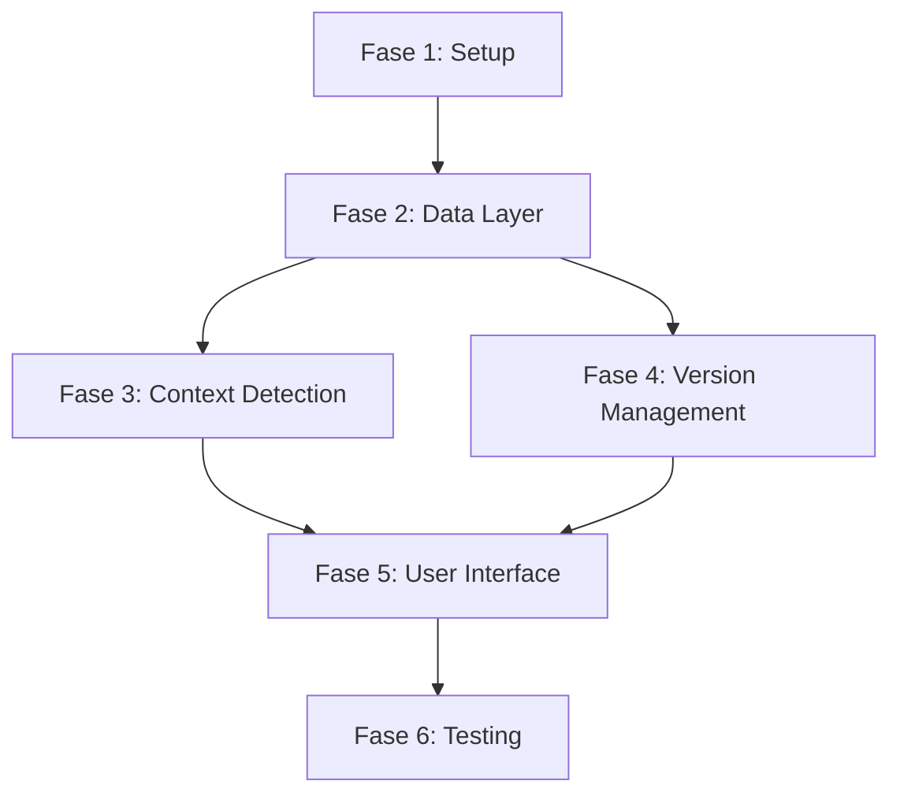

# Fases de Desarrollo - Timeline Writer

## Resumen de Fases

El desarrollo del plugin Timeline Writer se divide en 6 fases principales, cada una con objetivos específicos y entregables claramente definidos.

### Fase 1: [Setup y Fundación](./fase-1-setup.md)
**Duración**: 1-2 semanas  
**Objetivo**: Establecer la base técnica del proyecto
- Configuración inicial del proyecto Obsidian
- Setup de herramientas de desarrollo
- Estructura básica de directorios
- Sistema de build y testing

### Fase 2: [Data Layer](./fase-2-data-layer.md)
**Duración**: 2-3 semanas  
**Objetivo**: Implementar el sistema de persistencia y modelos de datos
- Interfaces TypeScript principales
- Storage Engine con SQLite
- Sistema de compresión y diff
- Migraciones y backup

### Fase 3: [Context Detection Engine](./fase-3-context-detection.md)
**Duración**: 3-4 semanas  
**Objetivo**: Motor inteligente de detección de cambios de contexto
- Análisis semántico con TF-IDF
- Detección multi-señal
- Fusión ponderada de señales
- Optimización de performance

### Fase 4: [Version Management System](./fase-4-version-management.md)
**Duración**: 2-3 semanas  
**Objetivo**: Sistema completo de versionado temporal
- Manager de versiones híbrido
- Timeline Engine ramificado
- Integración con Obsidian API
- Navegación temporal

### Fase 5: [User Interface](./fase-5-user-interface.md)
**Duración**: 3-4 semanas  
**Objetivo**: Interfaz de usuario completa e integrada
- Timeline visualization
- Comparison view
- Settings panel
- Integración nativa con Obsidian

### Fase 6: [Testing y Optimización](./fase-6-testing.md)
**Duración**: 2-3 semanas  
**Objetivo**: Pulir, optimizar y preparar para release
- Testing integral
- Optimización de performance
- Documentación completa
- Release preparation

## Dependencias Entre Fases

## Criterios de Completación

Cada fase debe cumplir con:
- [ ] Todos los entregables implementados
- [ ] Tests unitarios con cobertura >80%
- [ ] Documentación técnica actualizada
- [ ] Code review completado
- [ ] Performance benchmarks cumplidos

## Flexibilidad del Plan

- **Buffer de tiempo**: 20% adicional por fase para imprevistos
- **Paralelización**: Fases 3 y 4 pueden desarrollarse en paralelo parcialmente
- **MVP scope**: Cada fase define un MVP mínimo funcional
- **Iteraciones**: Posibilidad de ciclos cortos dentro de cada fase